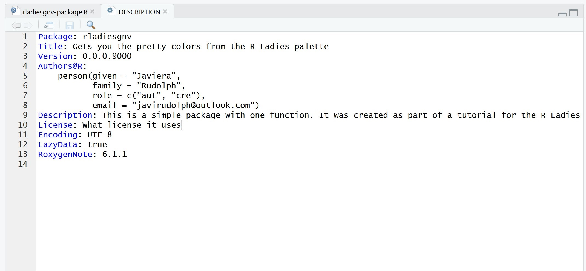

<style type="text/css">
body p {
  color: #88398A
;
}
</style>

```{r setup, include=FALSE}
knitr::opts_chunk$set(echo = TRUE, eval = FALSE)
```

## Introductions  

- Graduate student in Biology - UF
- Quantitative community ecologist
- '#rstats' enthusiast
- This is my first presentation with R markdown
    - Resources to customize
    - I'd love some good/easy tutorials
    - It wasn't a fun experience
        - Building a package is definitely easier

Twitter and Github **@javirudolph**
        
  
## Why packages?

- To share
    - Easy to share a bundle
    - Code + data + documentation + tests
    - Anyone can download -> install -> use
- For you
    - Easy organization
        - set conventions make life easier
    - Documentation
        - can't remember what that function was for?
        - forces you to write documentation
    - Load a package and have functions easily accessible
        - Reduce your 'source()' lines
        
## {data-background=imgs/source.png data-background-size=auto}

## Useful resources  

-  Hadley Wickham's [R packages](http://r-pkgs.had.co.nz/)
-  Emil Hvitfeldt's [blog post](https://www.hvitfeldt.me/blog/usethis-workflow-for-package-development/)
-  [devtools](https://devtools.r-lib.org/)


## Setup  
We recommend using the RStudio IDE and start by installing these packages.  


```{r eval = FALSE}
install.packages(c("devtools", "roxygen2", "usethis"))
```

 
- **devtools** simplify package development - [cheatseet](https://www.rstudio.com/resources/cheatsheets/) 
- **roxygen2** helps with the custom syntax used for package documentation  
- **usethis**  will set up components, directories, organize your package  

```{r eval =FALSE}
# load the libraries
library(devtools)
library(roxygen2)
library(usethis)

```

## Let's start!
Check your working directory, as this is were the package will be created. 
```{r}
getwd()
```

You can change your working directory and specify it with `setwd()` or within the package building function:

```{r}
usethis::create_package("your path if not doing setwd/ your package name")
```

You don't need to set up a project or anything, `usethis` takes care of the setup.  

After running the following line of code, you will have a new RStudio window open.
```{r}
usethis::create_package("rladiesgnv")
```

## create_package("your pkg name")
```{r echo = FALSE, eval = TRUE}

```

## Explore your new package

```{r echo = FALSE, eval = TRUE}

```


## Adding functions
After you've created the package, you will want to start adding some functions.  

As an example we will do a simple function that returns the color palette for R Ladies.  

The advantage of the package `usethis` is that as you edit certain files, it will make sure to keep everything connected and update any necessary files in other areas of the directory.

```{r}
library(usethis)

# Create the function file and edit
usethis::use_r("gimme_color_function")
```


## Adding functions continued... 

You will notice that `use_r` automatically created the `.R` file for your function and placed it in the `R/` directory.  

In the new script that opens, you can write your function.  

In our case, the function let's us get the hex color codes for the R Ladies palette.

```{r}
gimme_color_codes <- function(wantAll = TRUE){
  hex_palette <- c("#181818", "#D3D3D3", "#88398A", "#FFFFF", "#562457")
  if(wantAll == TRUE){
    print(hex_palette)
  }
  else{
    print("You should go for all of them.")
  }
}
```

## You've got a package!
And you are done with our minimal package!  
```{r}
# You can now press 'crt + shift + L'
# or

devtools::load_all()

```

This will 'build' and load the package. So you can test your new function by typing it in the console
```{r}
gimme_color_codes()
```

`[1] "#181818" "#D3D3D3" "#88398A" "#FFFFF"  "#562457"`

## Documentation
The `roxygen2` package lets you write documentation in the same .R file where you've specified your function and then `devtools` generates the documentation.  

You can write these comments before your function, which you can open using `use_r("gimme_color_function")` and start typing the comments with `#'`.  

```{r}
#' @title RLadies palette function
#'
#' @description This function will print out the hex codes for the RLadies palette
#' @param wantALL Do you want all the colors available in this palette? The default is TRUE
#' @keywords RLadies colors
#' @export
#' @examples
#' gimme_color_codes()
#'
```

## Documentation  

Then type `devtools::document()` in the console, so it generates the documentation (`.Rd` files in the `man/` directory). More info [here](http://r-pkgs.had.co.nz/man.html)  

.  
Open the `NAMESPACE` to check out the changes.  

Now, in the console:
```{r}
# 'ctrl + shift + b' or 
devtools::install()

# search for your function
?gimme_color_codes()
```

## Documentation
```{r echo = FALSE, eval = TRUE}

```

## Package documentation
We have edited the documentation for the function, but not for the overall package.  
To do that:  
```{r}
usethis::use_package_doc()
```

It will create an `.R` file used by `devtools` to create package documentation once we type `devtools::document()` in the console.  

When we check our package documentation:
```{r}
# 'ctrl + shift + b' or 
devtools::install()

?rladiesgnv
```

## Package documentation
```{r echo = FALSE, eval = TRUE}

```

## We should edit the package description
```{r echo = FALSE, eval = TRUE}

```

## cont...
```{r}
devtools::document()
devtools::install()
?rladiesgnv
```


and we can also add a license:

```{r}
usethis::use_mit_license("Your Name Here")
```

## ...
Or link for version control and publish to Github:  

```{r}
usethis::use_git()
usethis::use_github()
```

If you get an error with that last line, you probably haven't created an authorization token from Github:
```{r}
usethis::browse_github_pat()
usethis::use_github(protocol = "https", 
                    auth_token = "the token number you get from the Github site")
```

## Last, but not least
Once you publish your package to github, you can create a `README` that will let your users know what this repo is all about. 

```{r}
usethis::use_readme_rmd()
```

check out this package at: <https://github.com/javirudolph/rladiesgnv> and even install it. 
```{r}
# In a new RStudio session:
library(devtools)
devtools::install_github("javirudolph/rladiesgnv")
```


## Thank you!


You can follow me on twitter or github **@javirudolph**  

Email: javirudolph@outlook.com
